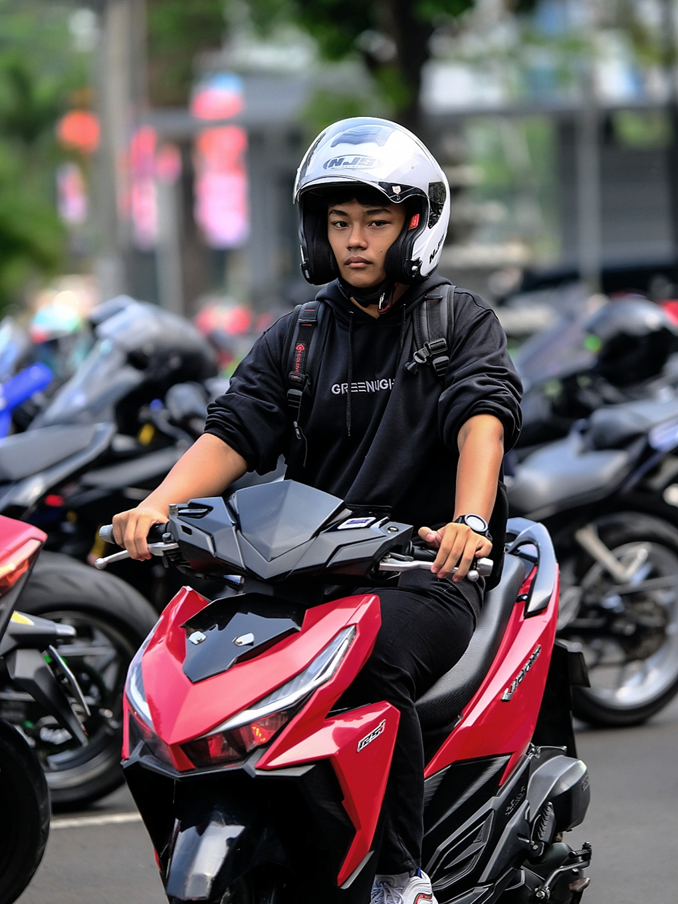
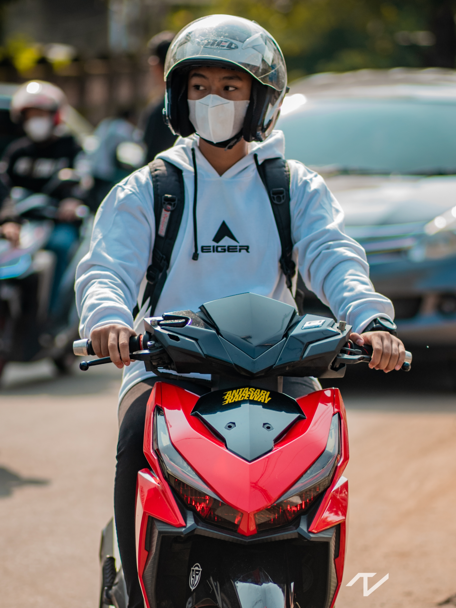
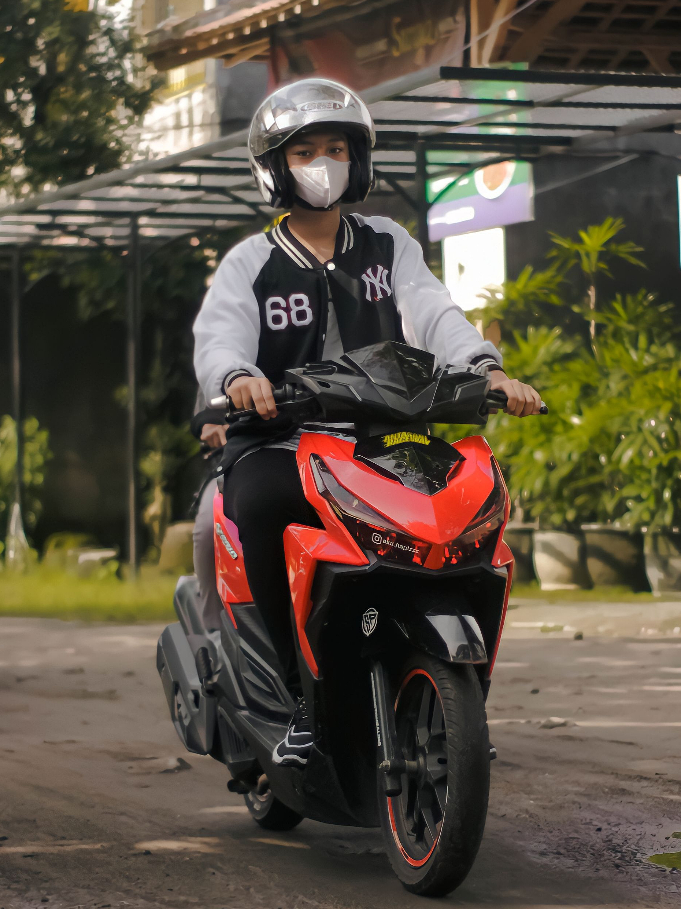
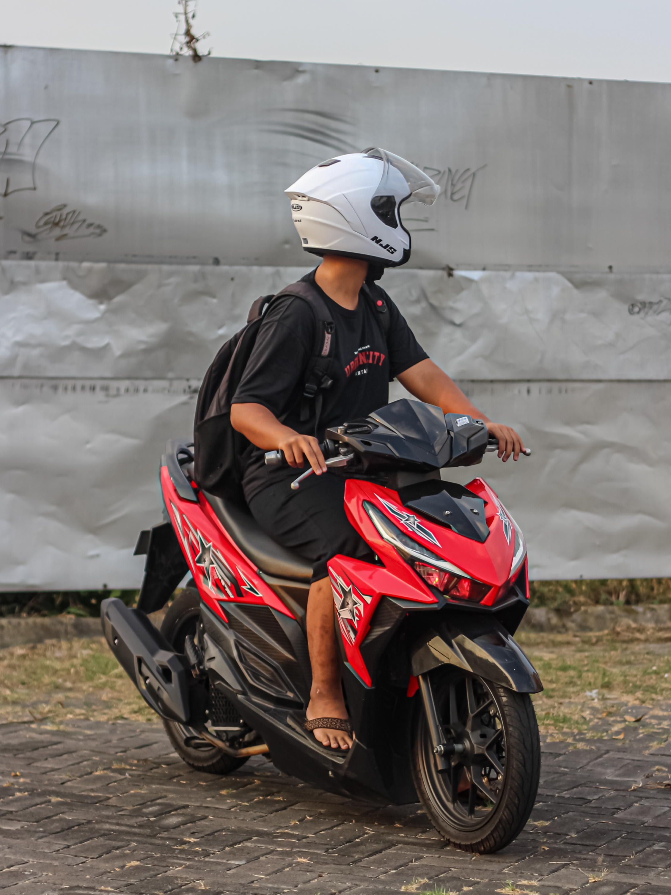
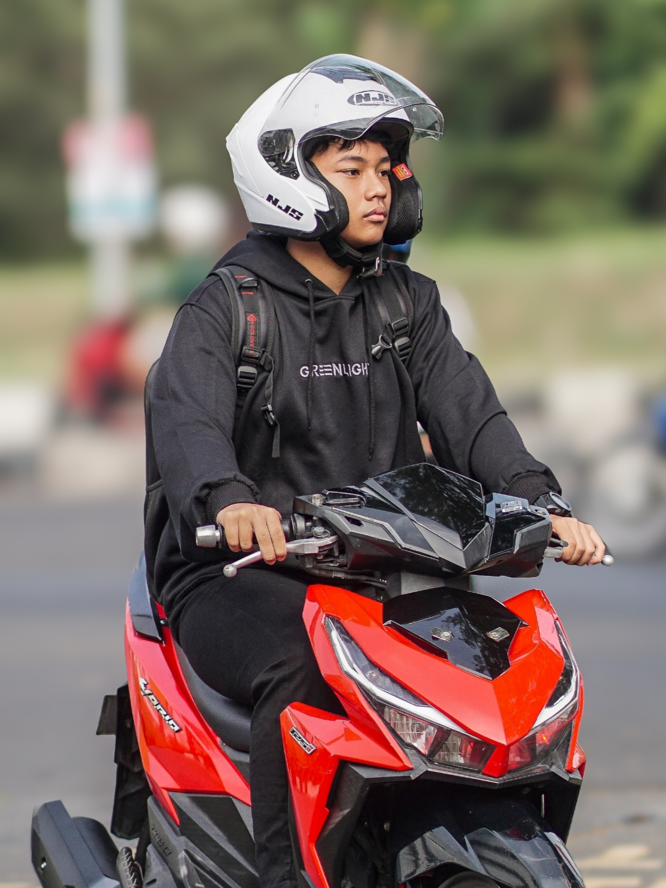
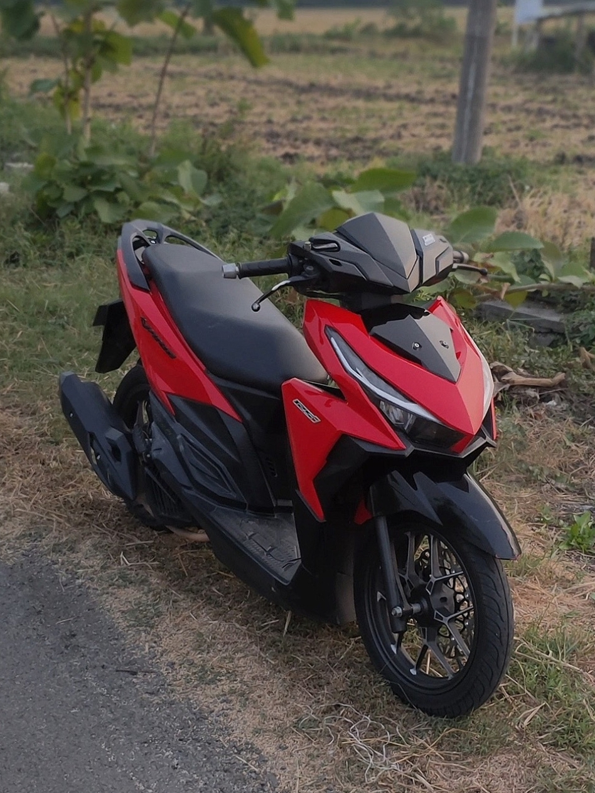
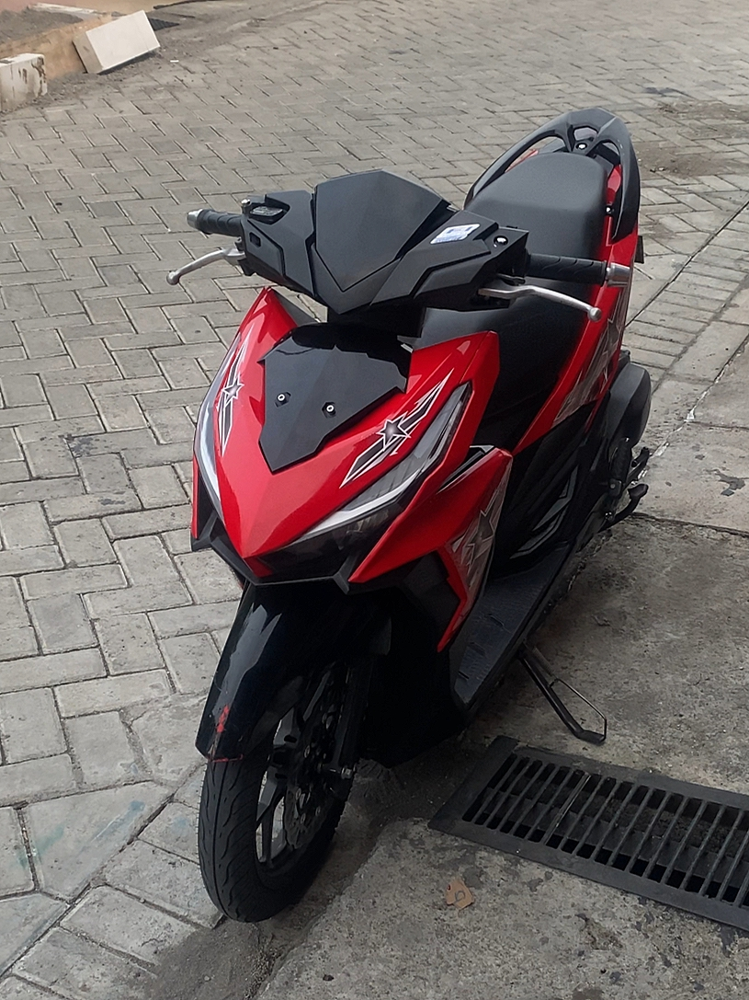
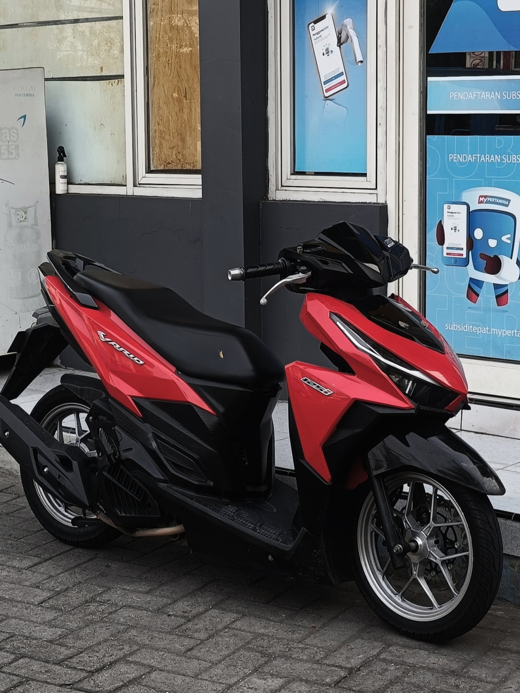

<!DOCTYPE html>
<html lang="en">
<head>
  <meta charset="UTF-8">
  <meta name="viewport" content="width=device-width, initial-scale=1.0">
  <title>Hapizzz</title>
  
</head>

<body class="bg-gray-100 text-gray-800">

  <!-- Navbar -->
  <header class="bg-black text-white">
    

      <h1 class="text-2xl font-bold mb-4 md:mb-0">Hapizzz</h1>
      <nav class="flex flex-wrap gap-4 space-x-0 md:space-x-6 text-center">
        <a href="#home" class="hover:underline">Ahnaf Hafizh Putra Efendi</a>
        <a href="#about" class="hover:underline">About Me</a>
        <a href="#team" class="hover:underline">My Team</a>
      </nav>
    

  </header>

  <!-- About Section -->
  <section id="about" class="bg-white py-16 px-4">
    

      

        <h3 class="text-2xl font-bold mb-4">About Me!!</h3>
        

          Aku Hapizzz, 18 Tahun dari Nganjuk, Jawa Timur. Aku adalah seorang Mahasiswa Teknik Informatika Politeknik Elektronika Negeri Surabaya, saat ini aku masih menjalani perkuliahanku di semester 1.
          Aku menjalani perkuliahanku dengan memiliki hobi bermain motor / jalan-jalan dengan sepeda motorku. Jika tertarik dengan kehidupanku bisa langsung kepoin ke Instagramku yaa @aku.hapizzz
        

      

      
    

  </section>

  <!-- Gallery Section -->
  <section id="gallery" class="bg-black py-16 text-white px-4">
    

      <h3 class="text-2xl font-bold mb-6">Gallery With My Motorcycle</h3>
      

        
        
        
        
      

      <h3 class="text-2xl font-bold mt-12 mb-6">Gallery My Motorcycle</h3>
      

        
        
        
        
      

    

  </section>

  <!-- Keahlian, Pengalaman, Edukasi -->
  <section id="service" class="bg-gray-100 py-16 px-4">
    

      <h3 class="text-2xl font-bold mb-6">Keahlian, Pengalaman, Edukasi</h3>
      

        

          <h4 class="text-xl font-bold mb-4">Software</h4>
          

            
            
            
            
          

        

        

          <h4 class="text-xl font-bold mb-4">Pengalaman</h4>
          
Editor Feed Instagram

          
JJ Capcut / Alight Motion

          
Cinematic Motor

        

        

          <h4 class="text-xl font-bold mb-4">Edukasi</h4>
          
MI AL-Muttaqin Lengkong (2012-2018)

          
MTsN 4 Nganjuk (2018-2021)

          
MAN 1 Nganjuk (2021-2024)

          
Politeknik Elektronika Negeri Surabaya (2024-Now)

        

      

    

  </section>

  <!-- Footer Section -->
  <footer class="bg-black text-white py-12 px-4">
    

      <nav class="flex flex-wrap justify-center gap-4 mb-6">
        <a href="#" class="hover:underline">My Team</a>
        <a href="#" class="hover:underline">About Me</a>
        <a href="#" class="hover:underline">Contact</a>
      </nav>
      
Enjoy the Steps For my Future, I will fight !!!

      

        
akuhapizz@gmail.com | +62 895-0239-1355

        
Nganjuk, Jawa Timur, Indonesia

        
© 2024 Ahnaf Hafizh. All Rights Reserved

      

    

  </footer>

</body>
</html>
